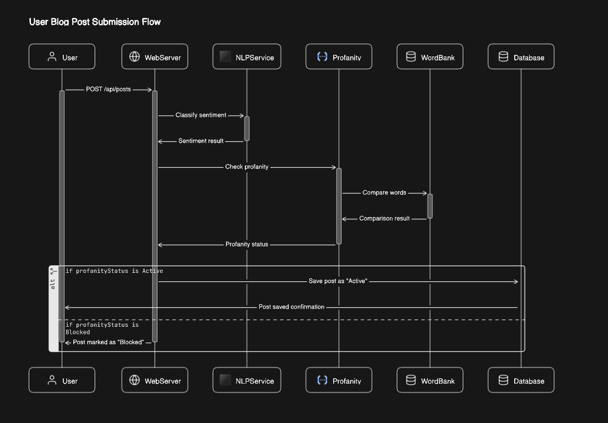
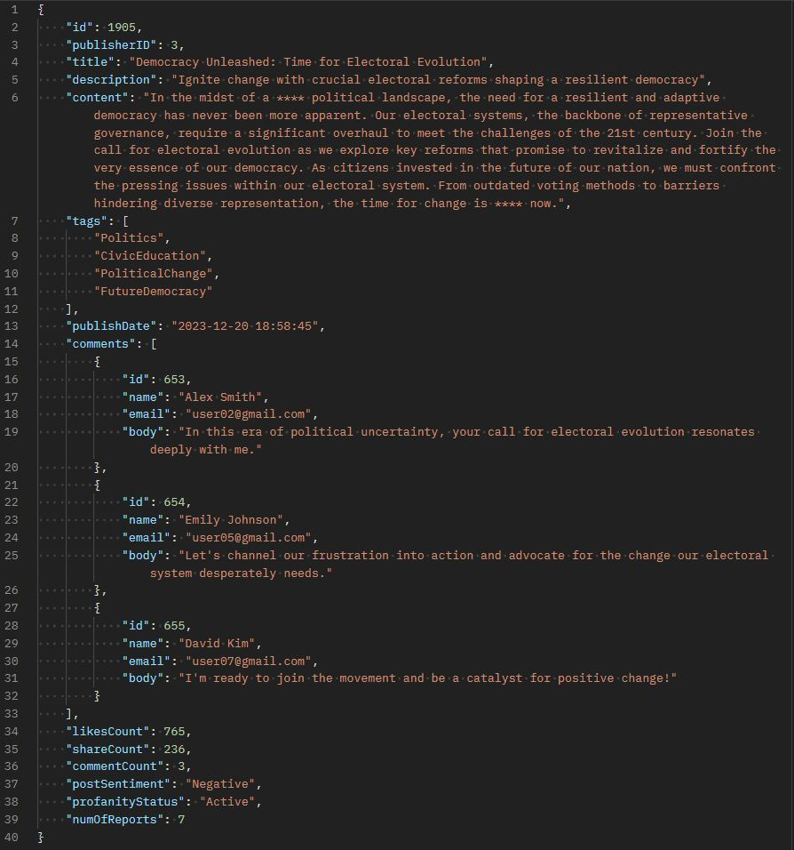
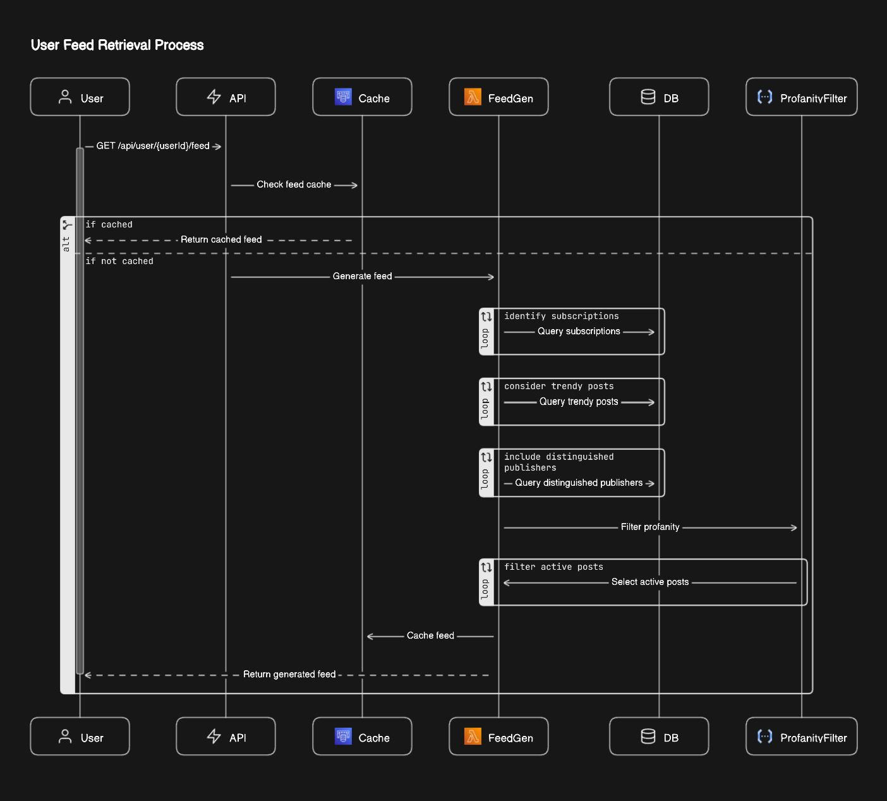

# Content Regulated Forum API

A powerful Spring Boot based platform that allows users to create, share, and explore engaging written content. This API leverages cutting-edge technologies to enhance user experience and content moderated quality.

## Create Forum Post Diagram:

## Sample Post After Sanitization:

## User Feed Recommendation:

# OpenAPI Specification:
- Linked Path: [src/main/resources/openapi.json](src/main/resources/openapi.json)
